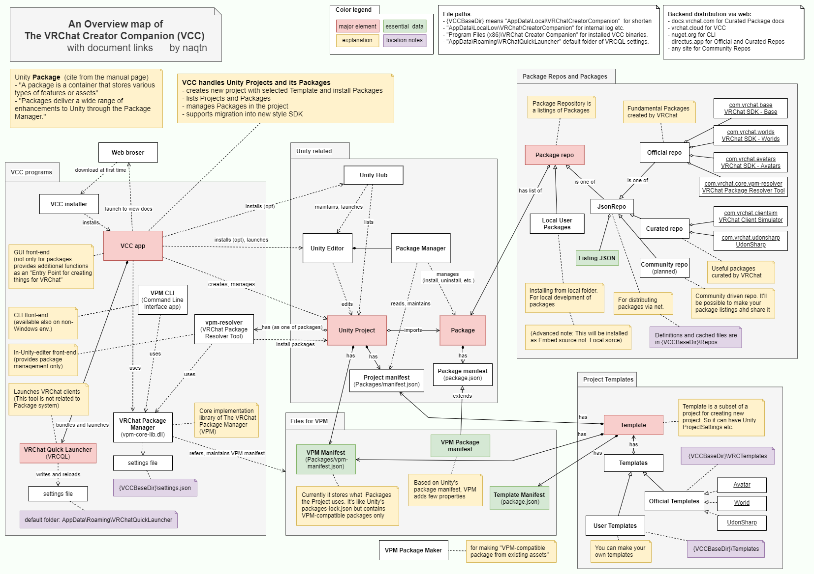

# The Architecture of VCC

- VCC (The VRChat Creator Companion) の実装に興味がある人向けにアーキテクチャを要点を述べます。
- これは VCC 1.0 リリース時点(2022/8/31)での情報を naqtn が独自に調べた内容です

## 構成図

（SVG 形式：[vcc-map-overview-detailed-en.svg](vcc-map-overview-detailed-en.svg)
PDF 形式：[vcc-map-overview-detailed-en.pdf](vcc-map-overview-detailed-en.pdf) ）

## 1. プログラム構成
- パッケージ管理 VPM はライブラリ（vpm-core-lib.dll）に実装されている
- そのライブラリは VCC と CLI と vpm-resolver とで個別にインストールされる
- 前記それぞれは異なる UI のフロントエンドを構成している

## 2. Repo
- VPM が Package の一覧 Repo を複数持っている（Repo は VPM におけるリポジトリの固有名詞？）
- 一覧はネットワークからダウンロードしてキャッシュを随時更新している
- 一覧の提供側は実のところ単なる JSON ファイルの配布
- その JSON には Package 毎のバージョンやその入手 URL などが書いてある
- VPM は以下を突き合せて依存性解決をする。（あわせてパッケージのバイナリを入手する）
  1. プロジェクトのパッケージ依存定義（VPM Manifest）
  2. Repos（依存しているパッケージを見つけ出す登録簿として）
  3. ダウンロードしてきた Package の中の依存定義（VPM Package manifest）
- 実際のインストール・更新・削除は VPM は Unity に行わせる
- なお、Local User Packages は展開されている Package のフォルダを個別に直接に登録する特殊な Repo

## 3. Template
- Template は Project のファイル構成のサブセット
- Package の Repoと異なり 今の所 Template には配布機能は無い
- VPM は Project 新規作成の際Templateをコピー元にする
- Template には VPM Manifest を入れるので、あとの Package 処理は通常の Project と同じ

## 4. Resolver
- vpm-resolver はそれ自身が Package の形態になっている。
- vpm-resolver は Unity エディタが起動すると、VPM Manifest とインストール済み Package を比較し同期させる
- これにより vpm-resolver と VPM Manifest だけ入っていれば、VRC SDK も含め Package の状態を復元できる
- この構成のために vpm-resolver は再配布可能なライセンスで運用されている

## 5. VPMが追加で行うこと
Package の実処理には Unity が使われる。よってVPMが追加で行うことはつまり以下。

- Unityのregistryとは別のPackageリスティングと配布
- より柔軟なバージョンの表記による依存性解決
- unitypackage形式からの移行の際に削除するファイルの扱い

（参考 [VPM Manifest Additions](https://vcc.docs.vrchat.com/vpm/packages/#vpm-manifest-additions)
こう書くと簡単そうなんだけど開発には何か月もかかってる。パッケージ管理は実に沼なんだなぁ。）
